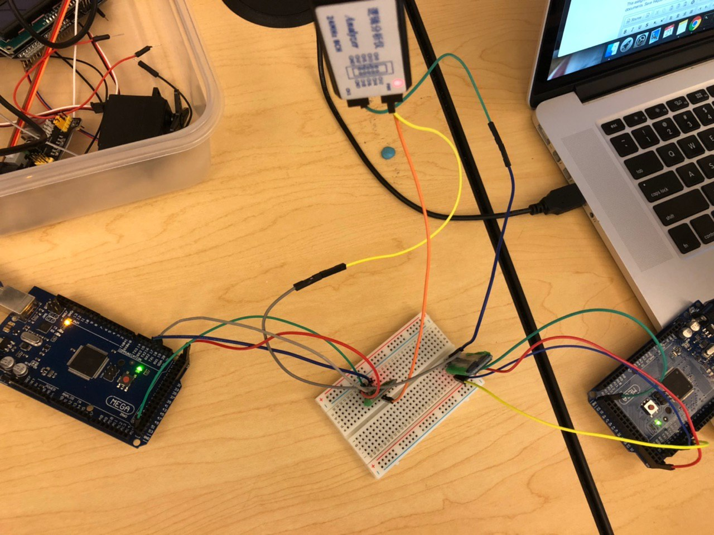

# The Legendary Roomba

Software for controlling a Roomba robot! It can shoot lasers and do other cool stuff too!!!

# Components and Programs

These are some simple programs and components used as part of the larger project in building out the functionality of the legendary roomba:

## UART Loopback

Simple program that does a "loop back" from UART0 to UART1 and back out from UART1 to UART0. Whatever you enter from your laptop will eventually echo back to the console via UART1.

## Bluetooth Loopback

Using two bluetooth modules for sending/receiving 32 characters from a base station wirelessly to another remote station and back.

## LED Fade

A program which will fade an LED from minimum brightness (OFF) to maximum brightness (ON) using the PWM timer. The fading period (min to max to min) should be close to our "breathing" period, which is 20 breaths per min for an adult, or once every 3 seconds, similar to when a laptop sleeps.
